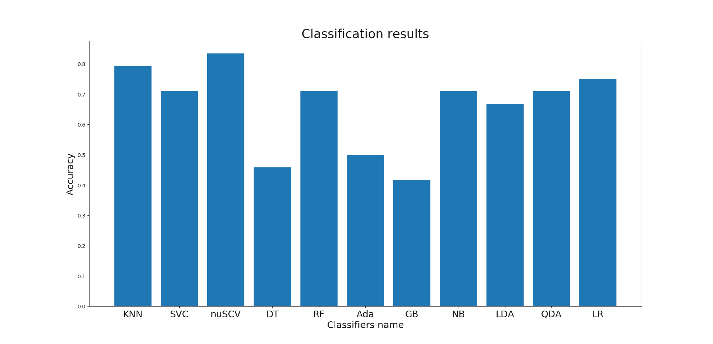
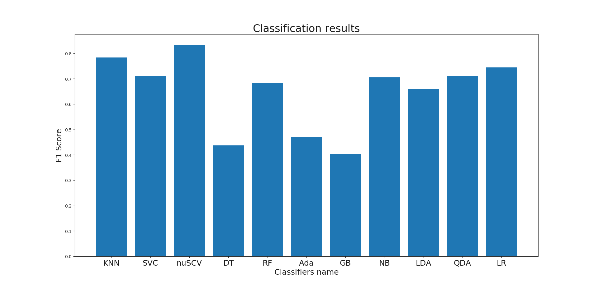
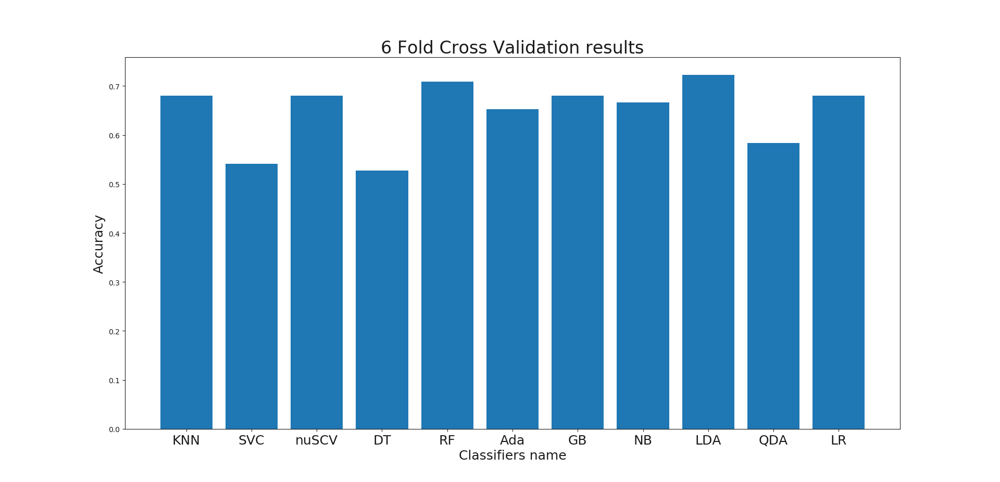

Data is downloaded from https://physionet.org/content/eegmat/  
We did not do any preprocessing and noise cleaning. We use data as provided in above source.

# ConvNet-for-EEG-cognitive-task-classification

To download data for use following lines of code  
import wfdb  
dbs = wfdb.get_dbs()  
wfdb.dl_database('eegmat','data')  

Note# dont forget to set path at line 25 according to you working directory

If you want to use already pretrained model we provided (checkpoint.h5), upload EEG_COGNITIVE_NET.ipynb and checkpoint.h5 file to goolge colab and start running https://colab.research.google.com/ . You can run it on local system provided all dependencies should be installed.  

In our paper accuracy is bit low becuase we dont save the best weights, we let the model to run till 50 epochs and but in checkpoint.h5 we saved the best weights. When we get best weights, we stop the mode

**Cross validation result**  
training accuracy:  0.7726719688067555  
training loss:  0.6399143008964026  
precision : 0.7930026540522858  
recall : 0.6962100144528908  
validation accuracy:  0.6360718068624305  
validation loss : 0.6504660593040789  

# Machine learning classification
Highest accuracy and F1 Score is 83% using SVM (nu hyper parameter).  
Highest accuracy after 6 fold cross validation is 72% obtained by LDA classifers.    

 
 

# Approach 2. 

* [File 1](https://github.com/talhaanwarch/EEG_mental_task/blob/master/Feature_Selection_Approach_2.ipynb)
⋅⋅1. No filtering
⋅⋅2. No model tuning
⋅⋅3. Max accuracy is 79.4%

* [File 2](https://github.com/talhaanwarch/EEG_mental_task/blob/master/Feature_select_app_2_butterworth_tuned.ipynb)
Buttworth filter is applied (0.1-45Hz).  
Model is tuned once before feature selection.  
Max accuracy is 79% using PCA

* [File 3](https://github.com/talhaanwarch/EEG_mental_task/blob/master/Feature_select_app_2_butterworth_30_tuned.ipynb)
Buttworth filter is applied (0.1-45Hz).  
Model is tuned once before feature selection.  
Max accuracy is 81.7% without feature selection

## Special Thanks  
https://github.com/forrestbao/pyeeg   
https://github.com/raphaelvallat/entropy   
https://github.com/mne-tools/mne-features   
